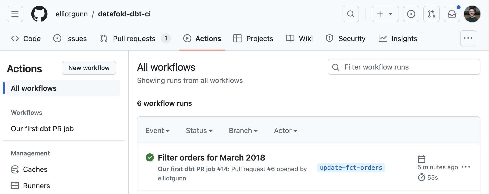

# About this project
This repo demonstrates how you can build your first CI pipeline with GitHub Actions for a simple dbt project. By the end of this project, you will see a CI pipeline that will, upon a new PR being opened in your dbt project, accomplish three things:
1. Ensure your dbt models compile and build properly
2. Test your dbt models with the test you’ve established for them
3. Run a SQL linter against your code changes

## Article and video tutorial
The article goes into more detail on each step [here](https://www.datafold.com/blog/building-your-first-ci-pipeline-for-your-dbt-project).

I also walk through the same tutorial in this 5 minute Loom:

<div>
    <a href="https://www.loom.com/share/bad67a7c24f3449d989bcc1900b875f3">
      <p>Building your first CI pipeline for your dbt project - Watch Video</p>
    </a>
    <a href="https://www.loom.com/share/bad67a7c24f3449d989bcc1900b875f3">
      
    </a>
  </div>

## What's in this repo?
It uses [seeds](https://docs.getdbt.com/docs/build/seeds) that includes fake raw data from a fictional app, via dbt lab's [jaffle shop test project](https://github.com/dbt-labs/jaffle_shop). You can also download the data directly [from here](https://github.com/dbt-labs/jaffle_shop/tree/main/seeds).

The best way to learn how to create your first GitHub Actions workflow is to fork this repository and follow our tutorial (link to be added upon publication). 

You can take a look at what's in our [super simple workflow here](https://github.com/elliotgunn/datafold-dbt-ci/blob/main/.github/workflows/dbt-pr-ci-job.yml) called ```Our first dbt PR job```

By the end of the tutorial, you will have run your first workflow!


## An example of how CI works
Imagine you would like to only analyze orders made in March 2018 (the full dataset, which you can see in the `orders.csv` file, contains orders between January to April 2018). 

Here's what a CI workflow should look like

1. We'll create a new branch to make our change in. In your terminal:
```
git checkout -b "update-fct-orders"
```

2. Then, update the `fct_orders.sql` file to add a filter:

```
orders as (
    -- Filtering orders to March 2018
    select * from {{ ref('stg_orders')}}
    where order_date >= '2018-03-01' and order_date <= '2018-03-31'
),
```

3. Commit the change to your respository and open a new PR. Here's the [open PR from this repository](https://github.com/elliotgunn/datafold-dbt-ci/pull/6).

4. Wait for our [GitHub Actions workflow](https://github.com/elliotgunn/datafold-dbt-ci/actions), that was automatically triggered with the opened PR, to finish running. Success! You can now merge to main with the confidence that our modified dbt model did not break anything and our code underwent linting. 



## Resources
Learn more about:
* SQLFluff's [resource for GitHub Actions](https://github.com/sqlfluff/sqlfluff-github-actions)
* [data-diff](https://github.com/datafold/data-diff) and [Datafold Cloud](https://www.datafold.com/)
* [dbt](https://docs.getdbt.com/docs/introduction)
